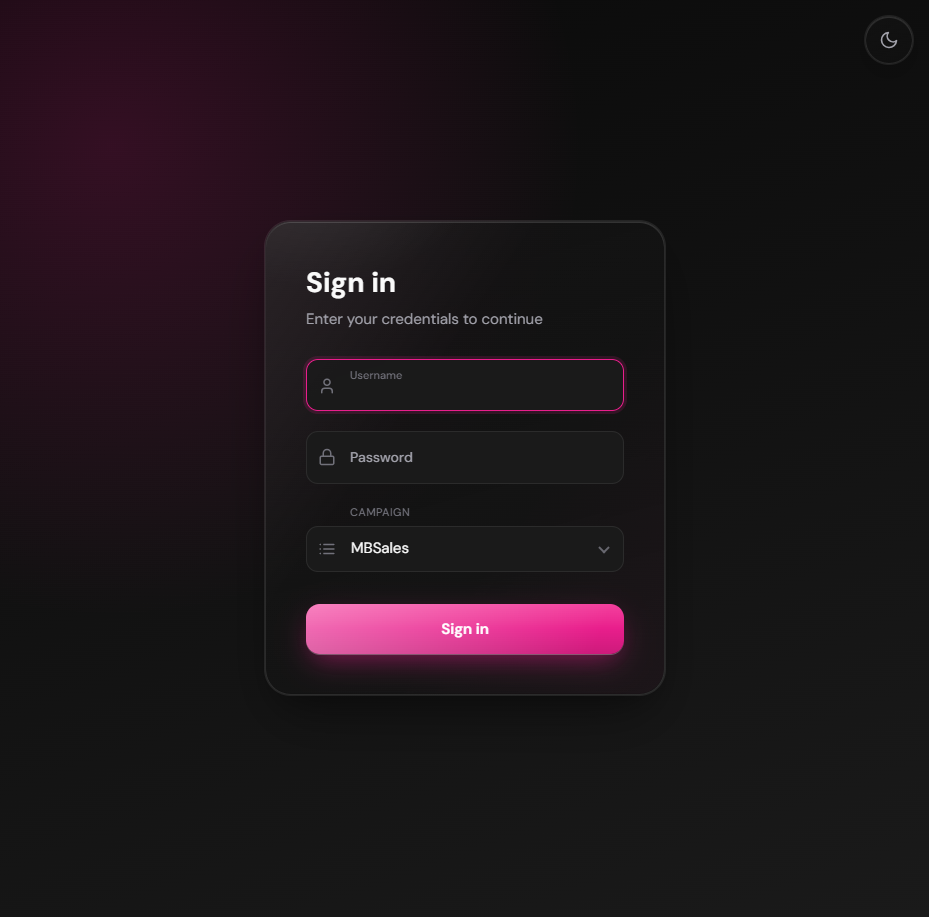
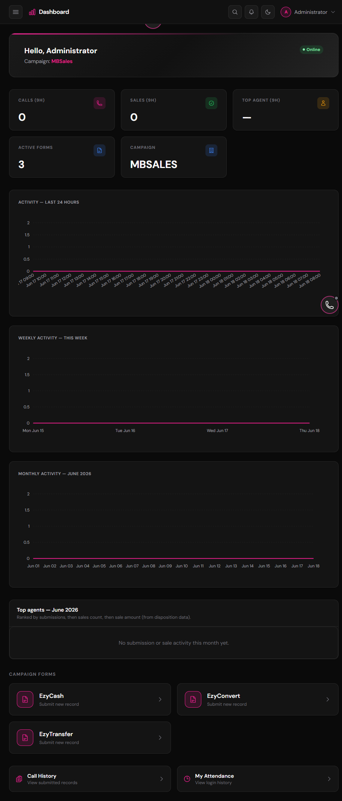
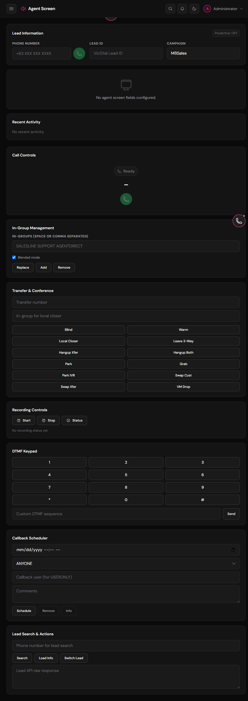
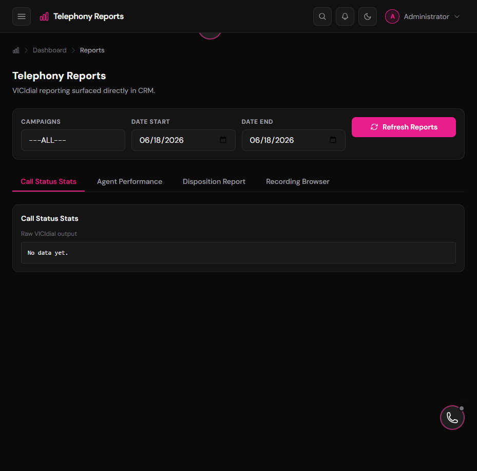
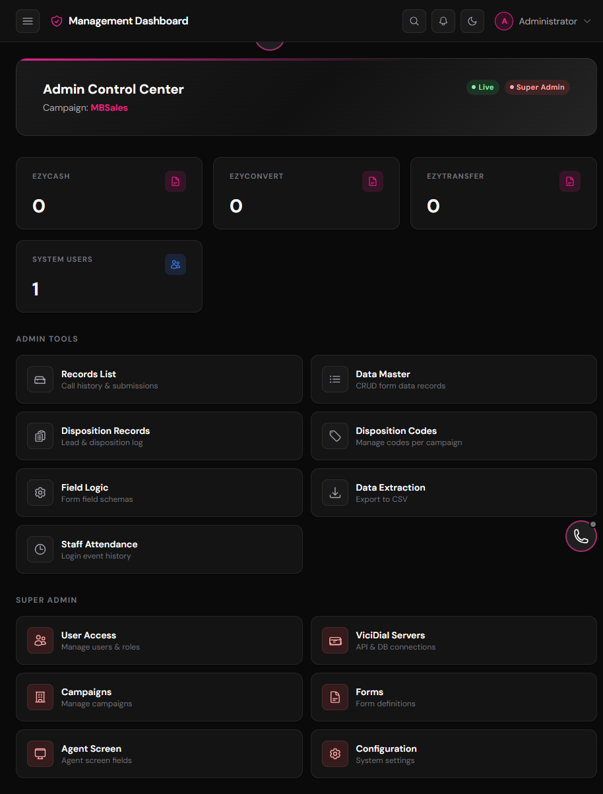
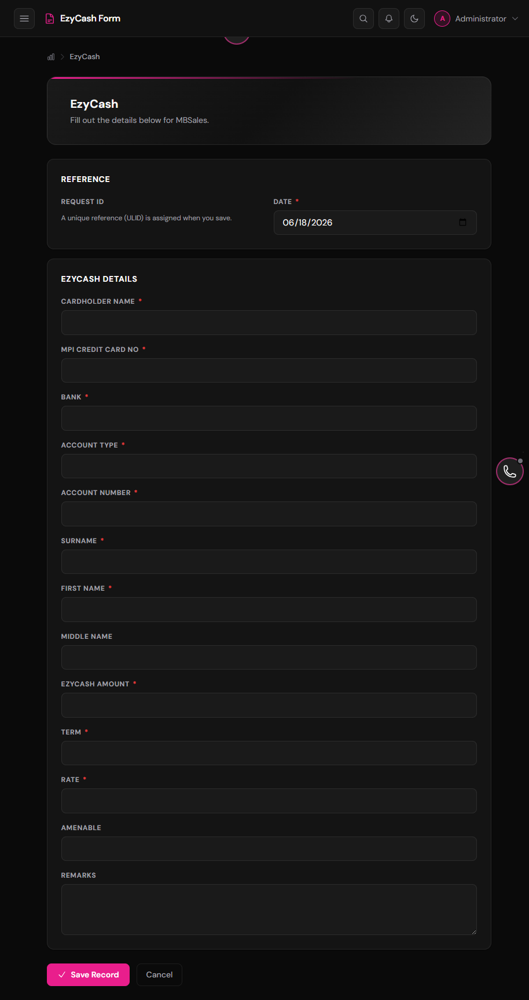

# Laravel CRM

Laravel CRM is a Laravel 12 customer relationship management platform built for call-center operations. It combines campaign-aware authentication, agent and admin workflows, VICIdial integration, Asterisk AMI support, a browser softphone powered by SIP.js and WebRTC, and real-time updates through Laravel Reverb.

## Table of Contents

- [Overview](#overview)
- [Features](#features)
- [Screenshot Gallery](#screenshot-gallery)
- [Prerequisites](#prerequisites)
- [Quick Start](#quick-start)
- [Installation Guide](#installation-guide)
- [Environment Configuration](#environment-configuration)
- [Running the App](#running-the-app)
- [Telephony and Integrations](#telephony-and-integrations)
- [Testing](#testing)
- [Deeper Documentation Plan](#deeper-documentation-plan)
- [License](#license)

## Overview

This application is designed for teams that need a CRM with telephony-first workflows. It supports campaign-based login, role-based access, lead handling, disposition management, attendance tracking, reporting, and admin tools for maintaining the telephony stack.

The codebase follows the Laravel 12 application structure and uses Blade views, controllers, middleware, queued jobs, events, observers, and service classes to keep the CRM and telephony logic separated.

## Features

- Campaign-aware login and session handling
- Role-based access control for Super Admin, Admin, Team Leader, and Agent users
- Agent workspace with softphone, call controls, lead tools, and disposition capture
- Admin screens for campaigns, forms, users, server settings, field logic, and lead hopper management
- VICIdial agent and non-agent API integration
- Asterisk AMI integration for outbound dialing and telephony event handling
- Laravel Reverb and Echo for real-time UI updates
- Attendance tracking and operational reporting
- Predictive dialing support with local lead hopper workflows
- Structured logging for audit, security, telephony, and rate-limit events

## Screenshot Gallery

These screenshots were captured from a seeded local development instance so readers can quickly understand the main areas of the application.

| View | Screenshot |
|------|------------|
| Login |  |
| Dashboard |  |
| Agent workspace |  |
| Telephony reports |  |
| Management dashboard |  |
| Campaign form |  |

The gallery is intentionally broad: it shows the authentication flow, the campaign dashboard, agent tools, reporting, administration, and a sample form screen.

## Prerequisites

- PHP 8.2 or newer
- Composer 2
- Node.js 20 or newer
- MySQL 8 / MariaDB 10.6 or SQLite for local development
- Redis if you plan to use Redis-backed cache, queue, or session drivers
- Asterisk and VICIdial if you plan to use the telephony features
- Supervisor for Horizon, Reverb, and long-running telephony workers in production

Recommended PHP extensions include:

- `mbstring`
- `bcmath`
- `pdo`
- `pdo_mysql` or SQLite support
- `openssl`
- `curl`
- `json`
- `xml`
- `ctype`
- `fileinfo`
- `tokenizer`

## Quick Start

1. Install PHP dependencies:

   ```bash
   composer install
   ```

2. Create your environment file and app key:

   ```bash
   cp .env.example .env
   php artisan key:generate
   ```

   On Windows PowerShell, use:

   ```powershell
   Copy-Item .env.example .env
   ```

3. Configure your database, app URL, and any telephony settings in `.env`.

4. Run the database migrations and seeders:

   ```bash
   php artisan migrate
   php artisan db:seed
   php artisan db:seed --class=RolesAndPermissionsSeeder
   ```

5. Link storage and install frontend assets:

   ```bash
   php artisan storage:link
   npm install
   ```

6. Start the application:

   ```bash
   composer run dev
   ```

   On Windows, you can also use `start-dev.bat`.

## Installation Guide

### 1. Clone the repository

Place the project in your web root or local development workspace and open the project directory.

### 2. Install backend dependencies

```bash
composer install
```

### 3. Set up environment variables

Copy `.env.example` to `.env`, generate the application key, and review the values for:

- `APP_*`
- `DB_*`
- `CACHE_*`
- `QUEUE_*`
- `SESSION_*`
- `REDIS_*`
- `BROADCAST_*`
- `REVERB_*`
- `VICI_*`
- `ASTERISK_*`
- `VITE_ASTERISK_*`
- `VITE_SIP_*`

```bash
php artisan key:generate
```

### 4. Configure the database

Use MySQL, MariaDB, or SQLite depending on your environment, then run:

```bash
php artisan migrate
php artisan db:seed
php artisan db:seed --class=RolesAndPermissionsSeeder
```

The default seed data creates the core CRM records, sample campaigns, form structures, disposition codes, and roles required for the application to open correctly.

### 5. Prepare storage

```bash
php artisan storage:link
```

### 6. Install frontend dependencies

```bash
npm install
```

For production builds:

```bash
npm run build
```

After deploying queue or job configuration changes, reload long-running workers so they pick up the new topology:

```bash
php artisan horizon:terminate
```

For deployments using `queue:work` instead of Horizon, use `php artisan queue:restart` and ensure the worker includes `--queue=telephony,default`.

### 7. Start background services

For local development, the easiest path is:

```bash
composer run dev
```

That starts the Laravel server, queue listener, log tailing, and Vite in one command.

If you prefer separate processes, start them individually:

```bash
php artisan serve
php artisan queue:work --queue=telephony,default
php artisan reverb:start
php artisan ami:listen
```

### 8. Configure telephony only if needed

If you are enabling telephony, configure VICIdial and Asterisk settings in `.env`, then review the deeper documentation linked below before going live.

## Environment Configuration

The most important environment groups are:

- `APP_*` for application identity and URL settings
- `DB_*` for your primary database connection
- `SESSION_*`, `CACHE_*`, `QUEUE_*`, and `REDIS_*` for runtime state
- `BROADCAST_*`, `REVERB_*`, and `VITE_REVERB_*` for real-time UI updates
- `VICI_*` for VICIdial integration
- `ASTERISK_*` for Asterisk AMI and softphone settings
- `VITE_ASTERISK_*` and `VITE_SIP_*` for frontend-exposed telephony settings

After changing production environment values, clear and rebuild cached configuration:

```bash
php artisan config:cache
```

## Running the App

Common commands used during development and operations:

- `composer run dev` - local all-in-one developer workflow
- `php artisan serve` - application server only
- `php artisan queue:work --queue=telephony,default` - queue worker
- `php artisan reverb:start` - realtime WebSocket server
- `php artisan ami:listen` - telephony event listener
- `php artisan horizon` - Horizon dashboard and queue worker manager
- `php artisan telephony:preflight` - telephony environment check
- `php artisan telephony:smoke-dial --user-id=ID --number=... --campaign=...` - dial path smoke test

## Telephony and Integrations

### VICIdial

Laravel talks to VICIdial for campaign and agent workflows. The app includes:

- Agent and non-agent API usage
- Session verification and control endpoints
- Campaign-level feature flags for telephony behavior
- SSL verification controls for on-premise or self-signed environments

### Asterisk AMI

AMI is used for outbound origination and event processing. The app also includes a webhook listener for AMI events and supporting jobs for reconciliation, logging, and alerts.

### Browser Softphone

The frontend uses SIP.js and WebRTC for browser-based telephony. This is the main path for agent softphone usage.

### Realtime Updates

Laravel Reverb and Echo are used for call state, notifications, and other live UI updates.

For more detail, see:

- `INSTALLATION.md`
- `MIGRATION.md`
- `docs/asterisk/VICIDIAL_DIRECT_CRM_INTEGRATION_GUIDE.md`
- `docs/asterisk/ASTERISK_WEBRTC_SETUP.md`
- `docs/telephony/`

## Testing

Run the application test suite with:

```bash
php artisan test
```

If you only changed a small area, you can also run a targeted test file or filter:

```bash
php artisan test --compact tests/Feature/ExampleTest.php
php artisan test --compact --filter=YourTestName
```

## Deeper Documentation Plan

This README should stay as the entry point. The deeper documentation should be split into focused guides:

1. `INSTALLATION.md` for production deployment, server prep, and long-running services
2. `MIGRATION.md` for the legacy MBSales to Laravel CRM migration notes
3. `docs/asterisk/VICIDIAL_DIRECT_CRM_INTEGRATION_GUIDE.md` for VICIdial and AMI wiring
4. `docs/asterisk/ASTERISK_WEBRTC_SETUP.md` for browser softphone setup
5. `docs/telephony/` for implementation phases, audits, and telephony behavior notes
6. `docs/audit/` for baseline audits, UI rules, security notes, and test findings

Suggested future docs, if you want this project documented like a mature GitHub repository:

- `docs/getting-started.md` for a short first-run walkthrough
- `docs/troubleshooting.md` for common install, login, telephony, and queue issues
- `docs/admin-guide.md` for campaign, user, and system administration
- `docs/agent-guide.md` for daily agent workflows
- `docs/release-notes.md` for deployment and version history notes

## License

This project follows the MIT spirit of the Laravel framework unless your organization applies a different license policy to the application code.
