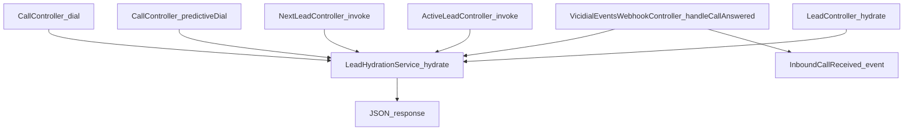

# Phase 8 - Lead Hydration, Capture Mapping, and Active-Lead Fallback

## Summary

Phase 8 adds a full lead data hydration and capture write-back flow between CRM and VICIdial:

- CRM can hydrate lead context (`lead_id`, `phone_number`, `client_name`, mapped `capture_data`) from VICIdial.
- Agent screen fields now support explicit VICIdial mapping (`vici_field`) and data direction (`get`, `post`, `both`, `none`).
- Capture submissions can push selected values back to VICIdial (`update_fields`) when configured.
- Real-time lead pop has push (`/api/webhooks/vicidial-events`) and polling fallback (`/api/telephony/active-lead`).
- Admin users can review/edit/export captured records by campaign.

---

## 1) Architecture and Entry Paths

`LeadHydrationService` is the central mapper and is called from multiple request paths:

Core references:

- `app/Services/Telephony/LeadHydrationService.php`
- `app/Http/Controllers/Api/CallController.php`
- `app/Http/Controllers/Api/NextLeadController.php`
- `app/Http/Controllers/Api/ActiveLeadController.php`
- `app/Http/Controllers/Api/LeadController.php`
- `app/Http/Controllers/Api/VicidialEventsWebhookController.php`

---

## 2) Lead Hydration Contract

`LeadHydrationService::hydrate(User $user, string $campaign, ?int $leadId = null, ?string $phoneNumber = null): array`

Return payload:

- `lead_id: ?string`
- `phone_number: ?string`
- `client_name: ?string`
- `capture_data: array<string,string>`
- `raw_fields: array<string,string>`

Behavior constraints:

- If both `leadId` and `phoneNumber` are empty, returns an empty payload immediately.
- If VICIdial `lead_all_info` fails, logs warning and returns the default payload.
- Parsing supports either:
  - key/value rows (`[['lead_id','123'], ...]`), or
  - header/data rows (`[['lead_id','phone_number'], ['123','...']]`).
- `capture_data` is populated only from configured `AgentScreenField` rows for the campaign whose `direction` is `get`, `both`, or null.

This design keeps hydration non-blocking in runtime call flows.

---

## 3) Agent Screen Mapping Model

`agent_screen_fields` now includes:

- `vici_field` (explicit VICIdial source/target field)
- `direction` (`get|post|both|none`)
- `field_type` (`text|number|email|tel|date|textarea|select|checkbox`)
- `options` (for `select`)
- `placeholder`
- `is_required`
- `field_order` (can now be set on create/update)

Migration:

- `database/migrations/2026_05_19_000001_extend_agent_screen_fields_for_capture_config.php`

Validation:

- `app/Http/Requests/Admin/StoreAgentScreenFieldRequest.php`
- `app/Http/Requests/Admin/UpdateAgentScreenFieldRequest.php`

Model cast/fillable:

- `app/Models/AgentScreenField.php`

---

## 4) Mapping Resolution Rules

When hydrating a CRM field value, VICIdial key selection follows:

1. Explicit `vici_field` if present.
2. Alias match from `config('vicidial_fields.aliases')`.
3. Prefix-stripped key (`customer_`, `cust_`, `lead_`) alias match.
4. Fallback to normalized `field_key`.

Normalization accepts lowercase `[a-z0-9_]` only.

Operational pitfall:

- `capture_data` records are stored by `field_key`.
- If an admin renames `field_key`, historical rows keep the old key and no longer map to the new config in admin views/export.
- Existing data is not deleted, but visibility/mapping can break without migration tooling.

---

## 5) Capture Write-Back to VICIdial

Capture submit flow:

1. `AgentCaptureController::store()` validates request and filters `capture_data` to allowed `field_key`s.
2. Record is saved to `agent_capture_records`.
3. `syncPostFieldsToVicidial()` optionally pushes to VICIdial `update_fields`.

Write-back constraints:

- Requires non-empty `lead_id`.
- Only fields with `direction in ('post','both')` are considered.
- Field must have non-empty `vici_field`.
- `vici_field` must be marked `writeable: true` in `config/vicidial_fields.php`.
- VICIdial push failures are logged via `TelephonyLogger` and do not fail the CRM save response.

Reference:

- `app/Http/Controllers/Api/AgentCaptureController.php`
- `app/Services/Telephony/LeadService.php`
- `config/vicidial_fields.php`

---

## 6) Push + Polling Lead-Pop Strategy

### Push path

- Endpoint: `POST /api/webhooks/vicidial-events`
- On `call_answered`, controller hydrates lead and emits `InboundCallReceived` with:
  - `phoneNumber`
  - `leadId`
  - `clientName`
  - `campaignCode`
  - `leadData`

### Polling fallback path

- Endpoint: `GET /api/telephony/active-lead` (named `api.telephony.active-lead`, throttled `60,1`)
- Uses non-agent API `agent_status`.
- Returns active snapshot with hydration when status is `INCALL` or `QUEUE`.

This allows operation when push events are delayed/misconfigured while preserving instant push when available.

---

## 7) Admin Capture Records Operations

New admin controller supports campaign-scoped review:

- `GET admin/capture-records` - list with filters (agent, lead_id, phone, date range)
- `GET admin/capture-records/edit/{record}` - edit form
- `POST admin/capture-records/update/{record}` - update
- `POST admin/capture-records/delete` - delete by id
- `POST admin/capture-records/export` - CSV export

CSV format:

- Fixed columns: `id, campaign, created_at, agent, lead_id, phone_number`
- Dynamic columns: ordered campaign `field_key` list from `agent_screen_fields`

Security/scoping:

- Edit/update/delete check `recordBelongsToCampaign(...)` before mutating.
- `sanitizeCaptureData(...)` drops keys not configured for the selected campaign.

Reference:

- `app/Http/Controllers/Admin/CaptureRecordsController.php`
- `routes/web.php`

---

## 8) API Surface Quick Reference

| Method | Route | Purpose | Notes |
|--------|-------|---------|-------|
| GET | `/api/leads/hydrate` | Manual hydration endpoint | Requires `lead_id` or `phone_number` |
| GET | `/api/telephony/active-lead` | Poll active call/queue lead | Fallback to push events |
| POST | `/api/webhooks/vicidial-events` | Push event ingress | Optional webhook secret check |
| POST | `/api/agent/capture` | Save capture and optional write-back | Write-back gated by `direction` and `writeable` |

---

## 9) Hangup Behavior Update

`CallOrchestrationService::hangup(...)` now accepts `?string $campaignOverride` and resolves campaign in this order:

1. Active session `campaign_code`
2. Provided `campaignOverride`
3. `config('vicidial.default_campaign', 'mbsales')`

If there is no CRM active session, the method still performs VICIdial pause/hangup attempt and returns success with:

- `['vicidial_only' => true]`

This improves idempotency for UI and recovery paths where CRM session state and VICIdial state may be temporarily out of sync.

---

## 10) Runbook Notes and Common Pitfalls

- Keep `config/vicidial_fields.aliases` updated when VICIdial schema uses alternative names, or hydration may return empty mapped fields.
- Keep `config/vicidial_fields.fields.{name}.writeable` strict; write-back ignores non-writeable fields by design.
- Use `direction=get` for read-only fields, `post` for write-only forms, `both` for bidirectional sync.
- Avoid renaming `field_key` on active campaigns without a data migration plan for historical `agent_capture_records.capture_data`.
- For troubleshooting, inspect telephony warnings from:
  - `LeadHydrationService` (lead fetch failure)
  - `AgentCaptureController` (update_fields push failure/exception)

